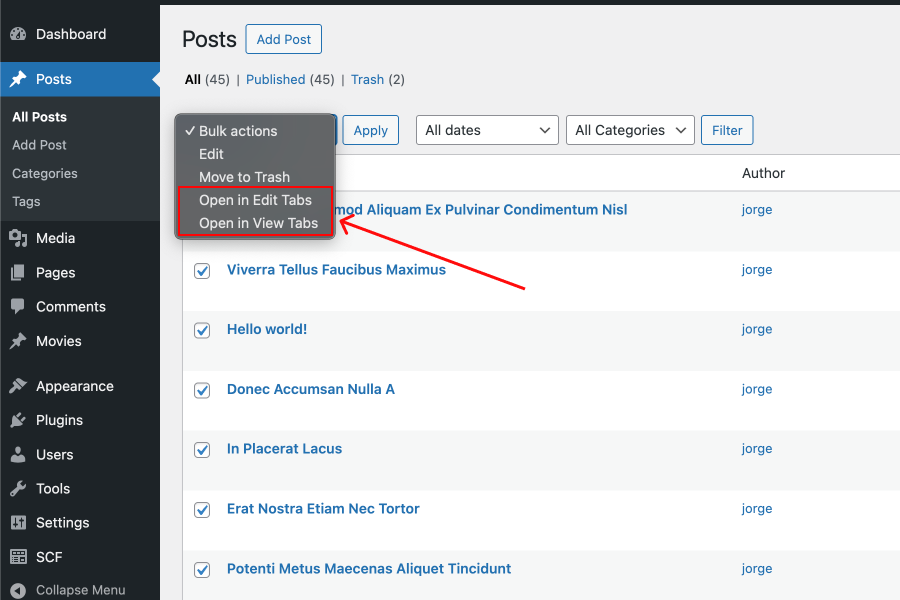

# Post Bulk Actions

**Open multiple posts or pages in separate browser tabs using WordPress bulk actions.**

This lightweight plugin adds two new bulk actions to the WordPress admin interface:

- ✅ **Open in Edit Tabs** – Opens each selected post in edit mode, in a new tab.
- ✅ **Open in View Tabs** – Opens each selected post in view mode (front-end), in a new tab.

Supports all public post types, including custom post types.

---

## 🧩 Features

- Works with Posts, Pages, and any Custom Post Type
- Open selected posts in **edit mode** tabs
- Open selected posts in **view mode** tabs
- Simple, fast, and no configuration required

---

## 📦 Installation

1. Download or clone this repository
2. Copy the plugin folder to your WordPress site's `/wp-content/plugins/` directory.
3. Log in to your WordPress dashboard and activate **Post Bulk Actions** from the Plugins page.

Or download the ZIP from the [Releases](https://github.com/jorgearaya474/post-bulk-actions/releases) page and upload it through the WordPress admin.

---

## 🚀 Usage

1. Go to the WordPress admin.
2. Navigate to **Posts**, **Pages**, or your Custom Post Type list.
3. Select multiple items using the checkboxes.
4. Choose either **“Open in Edit Tabs”** or **“Open in View Tabs”** from the bulk actions dropdown.
5. Click **Apply** – the selected items will open in new browser tabs.

Here’s how the bulk action appears in the WordPress post list:

---

## 🌍 Localization

This plugin is translation-ready. You can contribute translations or use tools like Loco Translate.

Text domain: `post-bulk-actions`

---

## 🤝 Contributing

Pull requests are welcome. If you encounter a bug or have a feature request, please open an [issue](https://github.com/tu-usuario/post-bulk-actions/issues).

---

## 📜 License

This plugin is licensed under the [GPLv2 or later](https://www.gnu.org/licenses/gpl-2.0.html).

## ✨ Author

Developed by [Jorge Araya](https://jorgearaya.com).  
